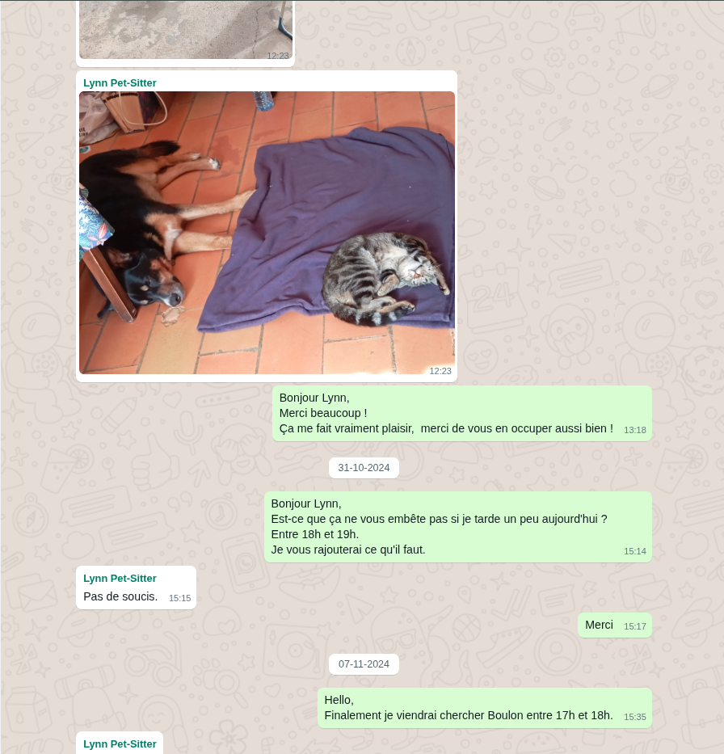

# WhatsApp Exporter

This simple tool convert an extracted conversation from whatsapp to an html
which looks like whatsapp web.

## Description

I did this project to keep the conversation I had with the women I love, and
who is gone to sky.


It allow to view images and videos, not yet vocals.
As "reply" messages and reaction emojis are not present in the official whatsapp export, it's not present in the rendered html too.

## Preview



## Getting Started

### Dependencies

- uv
- python >= 3.10.7

### Installing

`uv sync`

### Executing program

- Download zip export from whatsapp and unzip into a directory
- the folder `whatsapp` is gitignored in the repository, it could be a good
  place.
- remove the first line of the txt file in the directory
- the program expect two arguments: the directory and the user name of the
  conversation owner (to know who you are).
```bash
uv run waexp <directory> <username>

# Example
uv run waexp whatsapp Xavier
```

## TODO

- ignore the first line to avoid to remove it manually
- manage vocals messages

## Authors

Contributors names and contact info

- [@xavier-balesi](https://github.com/xavier-balesi)

## License

This project is licensed under the GNU GENERAL PUBLIC LICENSE License - see the LICENSE.md file for details
